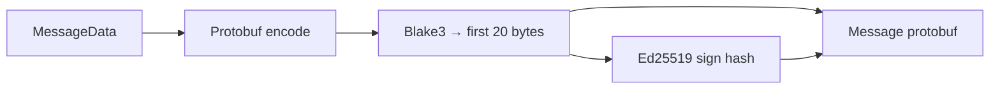

# How hypersnap validates signed messages

This describes behavior implemented in the **hypersnap** codebase (fork under `subs/hypersnap/`). It is the reference for what the SDK must produce so a node accepts a `submitMessage` request.

## Wire format

- **HTTP:** `POST /v1/submitMessage` with `Content-Type: application/octet-stream` and body = protobuf-encoded **`Message`**.
- **Response:** JSON (`Types.V1.Message`) — the hub maps protobuf to JSON for responses.

The SDK mirrors this: **clients** produce **protobuf bytes**; optional **hub JSON** is for your own relay API (mobile → server).
`hubJsonToProtobufBytes` converts that JSON back to the same bytes the node expects.

## Message envelope (`protobuf`)

`Message` (see `proto/farcaster_message.proto` in this repo) contains:

| Field | Role |
|-------|------|
| `data` | `MessageData` — FID, timestamp, network, and one `body` variant (cast, reaction, link, …) |
| `hash` | 20 bytes — Blake3 truncated digest of the canonical serialized `MessageData` |
| `hash_scheme` | Must be **`HASH_SCHEME_BLAKE3` (1)** |
| `signature` | 64 bytes — Ed25519 signature |
| `signature_scheme` | Must be **`SIGNATURE_SCHEME_ED25519` (1)** |
| `signer` | 32 bytes — Ed25519 **public** key of the signer |

Optional `data_bytes` (snapchain) can be used by nodes to carry alternate serialization; this SDK sets the standard `data` field and encodes `MessageData` with protobufjs.

## Hashing (`validate_message_hash`)

Implementation concept (see `subs/hypersnap/src/core/validations/message.rs`):

1. Serialize **`MessageData`** to bytes (either `data` field encoded, or `data_bytes` if present).
2. Compute **Blake3** over those bytes.
3. Compare the **first 20 bytes** of the Blake3 output to `message.hash`.

The Rust helper `blake3_20` in `subs/hypersnap/src/storage/util.rs` takes the first 20 bytes of the Blake3 hash. The SDK’s `blake3_20` matches this.

## Signing (`validate_signature`)

For `SIGNATURE_SCHEME_ED25519`:

1. The **signer** field must be a valid **32-byte Ed25519 public key**.
2. The **signature** must be a valid **64-byte Ed25519 signature** over **`message.hash`** (the **20-byte digest**), not over the full `MessageData` blob.

So the signed payload is exactly the **20-byte Blake3 digest**, using Ed25519.

**Important:** This is **not** EIP-712 or secp256k1. A **viem Ethereum wallet** does not produce these signatures. The user must use the **Farcaster app signer** secret (32-byte Ed25519 seed) that was registered for their FID.

## Message-level checks (`validate_message`)

After hash and signature, the node decodes `MessageData` and runs type-specific checks (text length, link type length, reaction targets, timestamps vs hub time, etc.). It also ensures:

- FID is registered on-chain.
- The signer is an **active** signer for that FID.

Those depend on live node state; the SDK only ensures **cryptographic** correctness and **protobuf** shape.

## JSON representation (hub HTTP)

When the hub returns a `Message` as JSON, it uses string enums (`MESSAGE_TYPE_CAST_ADD`, `HASH_SCHEME_BLAKE3`, …), `0x` hex for binary fields like `hash` and `signer`, and **base64** for `signature`. The SDK’s `protobufMessageBytesToHubJson` / `hubJsonToProtobufBytes` match that shape for relay use.

## Diagram

